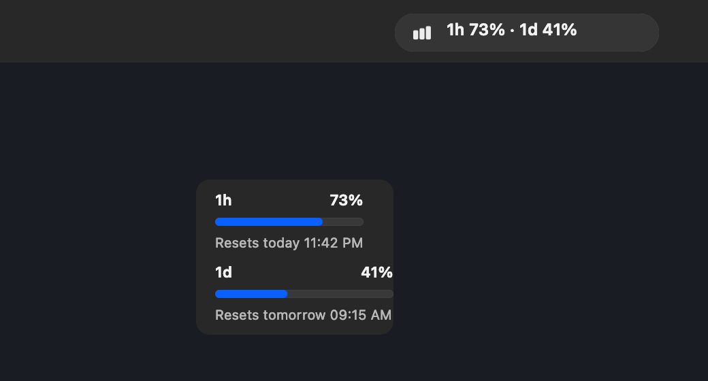

[English](README.md) | [Русский](README.ru.md)

# Codex Limits Menu Bar

Нативное macOS menu bar приложение, которое показывает текущие лимиты использования Codex.

Оно читает usage-данные из локальной установки `codex` и держит этот сигнал прямо в menu bar, чтобы не приходилось постоянно открывать экран usage и проверять остаток вручную.

**Скачать:** [Последний релиз](https://github.com/ai-meatbags/codex-limits-menubar/releases/latest) · [Прямой macOS zip](https://github.com/ai-meatbags/codex-limits-menubar/releases/latest/download/CodexLimitsMenuBar-macos-latest.zip)



## Зачем это нужно

Лимиты Codex — важный операционный сигнал, но стандартный путь требует открывать интерфейс и проверять usage вручную. Это приложение выносит этот сигнал в macOS menu bar, чтобы быстрее понимать, можно ли продолжать интенсивную работу или пора экономить запросы.

## Модель доверия

- единственный источник правды: локальный `codex app-server`
- никакого browser scraping, переиспользования сессий или приватных web endpoints
- никаких stale или выдуманных данных: при сбое приложение показывает unavailable snapshot

## Что показывает приложение

- компактный заголовок в menu bar с основными remaining percentage
- reset time для видимых bucket'ов
- dropdown с usage bars
- account label, если `account/read` возвращает данные об аккаунте
- быстрые действия для refresh, usage page, logs и quit

Если загрузка не удалась, приложение показывает error snapshot, а не придумывает данные и не скрывает проблему.

## Требования

### Чтобы запустить готовый release artifact

- macOS
- локально установленный `codex`, доступный в `PATH`
- активный `codex login`
- локально установленный `node`

### Чтобы собрать приложение из исходников

- все runtime requirements выше
- Xcode command line tools (`xcrun swiftc`)
- внешние npm-зависимости сейчас не требуются

## Быстрый старт

Собрать и открыть приложение:

```bash
npm run menubar:app
```

Собрать release bundle без открытия:

```bash
npm run menubar:app:build
```

Упаковать GitHub-ready release artifact:

```bash
npm run release:artifact
```

Сгенерировать скриншот для README:

```bash
npm run menubar:app:screenshot
```

Теперь команда выпускает и версионные артефакты, и стабильный alias для будущего `latest`-линка:

```bash
dist/CodexLimitsMenuBar-v<version>-macos.zip
dist/CodexLimitsMenuBar-v<version>-macos.zip.sha256
dist/CodexLimitsMenuBar-macos-latest.zip
dist/CodexLimitsMenuBar-macos-latest.zip.sha256
```

Собранное приложение появится здесь:

```bash
dist/CodexLimitsMenuBar.app
```

Упакованные release artifacts появятся здесь:

```bash
dist/CodexLimitsMenuBar-v<version>-macos.zip
dist/CodexLimitsMenuBar-v<version>-macos.zip.sha256
dist/CodexLimitsMenuBar-macos-latest.zip
dist/CodexLimitsMenuBar-macos-latest.zip.sha256
```

Папка `dist/` — это выходная папка для release-сборок и готовых артефактов.

## Как это работает

1. Стартует Swift menu bar app.
2. Оно запускает встроенный Node snapshot script.
3. Node script поднимает `codex app-server`.
4. Затем отправляет JSON-RPC запросы:
   - `initialize`
   - `account/read`
   - `account/rateLimits/read`
5. Ответ нормализуется в компактный snapshot.
6. Swift рендерит snapshot в menu bar и периодически его обновляет.

Release bundle ищет `node` и `codex` на машине, где запускается приложение, и при необходимости уважает явные overrides.

## Структура проекта

- `macos/CodexLimitsMenuBar` — AppKit menu bar shell
- `src/cli/codex-limits-menubar-snapshot.mjs` — snapshot entrypoint
- `src/app-server/jsonlAppServerClient.mjs` — JSON-RPC клиент для app-server
- `src/rate-limits/menubarSnapshot.mjs` — нормализация ответа и подготовка view snapshot
- `scripts/build-codex-limits-menubar-swift-app.sh` — сборка `.app` bundle в `dist/`
- `scripts/run-codex-limits-menubar-app.sh` — сборка и открытие приложения

## Переменные окружения

- `CODEX_LIMITS_CODEX_BIN` — переопределить путь к `codex`
- `CODEX_LIMITS_NODE_BIN` — переопределить путь к `node`, который использует `.app`
- `CODEX_LIMITS_LOG_FILE` — переопределить путь к лог-файлу
- `CODEX_LIMITS_TIMEOUT_MS` — переопределить timeout для app-server вызовов

Если ты запускаешь `.app` из Finder, а `node`/`codex` лежат вне стандартных CLI-paths, перед запуском лучше явно задать `CODEX_LIMITS_NODE_BIN` и `CODEX_LIMITS_CODEX_BIN`.

## Логи

Лог по умолчанию:

```bash
~/Library/Logs/CodexLimitsMenuBar/app.log
```

Приложение пишет туда:

- lifecycle старта и refresh
- stderr от app-server
- ошибки parse snapshot'а
- runtime execution errors

## Troubleshooting

### Приложение показывает недоступные лимиты

Проверь:

- `codex` установлен и работает в shell
- `codex login` активен
- приложение может найти корректные `node` и `codex`
- в логах есть успешные `initialize` и `account/rateLimits/read`
- при необходимости заданы `CODEX_LIMITS_NODE_BIN` / `CODEX_LIMITS_CODEX_BIN`

### Сборка падает

Проверь:

- доступен `xcrun swiftc`
- доступен `node`
- `codex` установлен до сборки и доступен при запуске приложения
